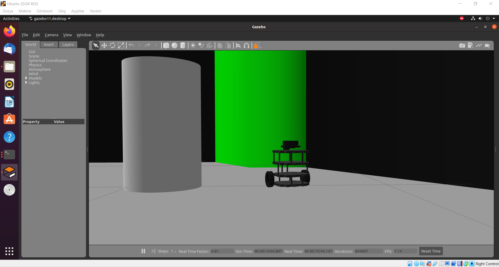
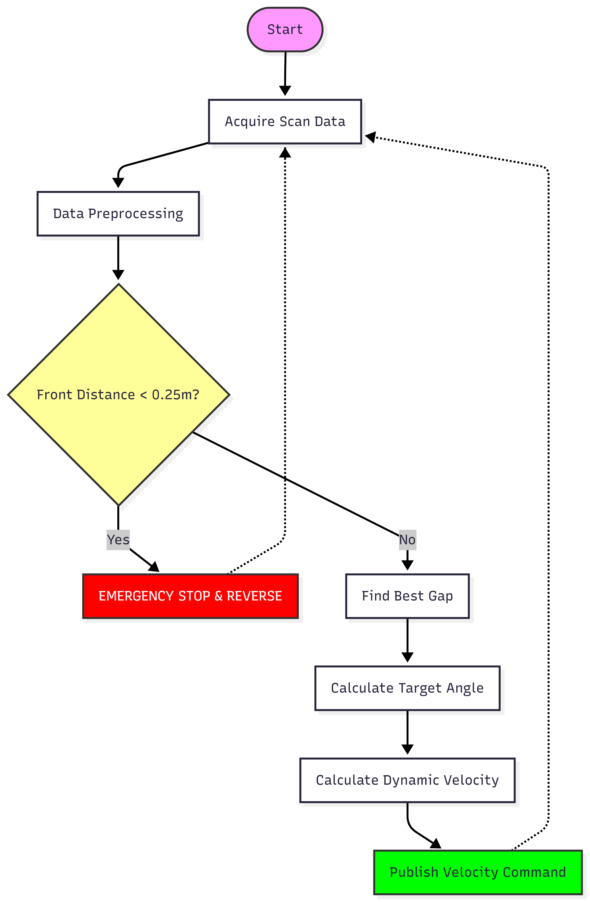
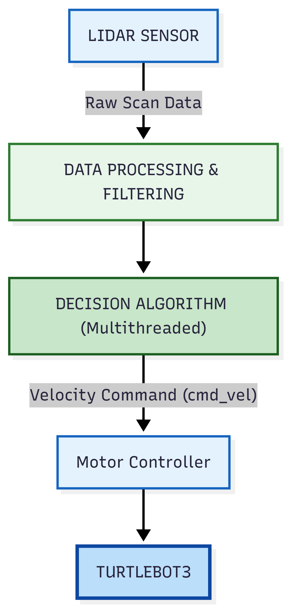
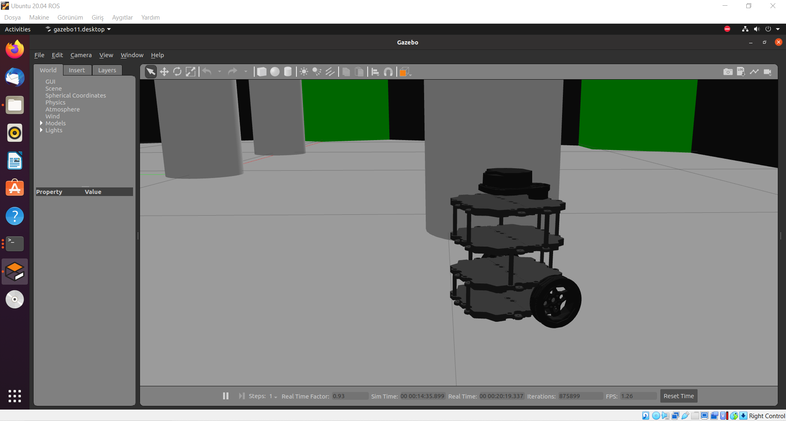
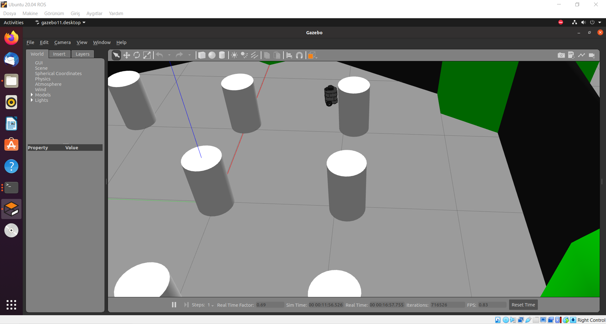
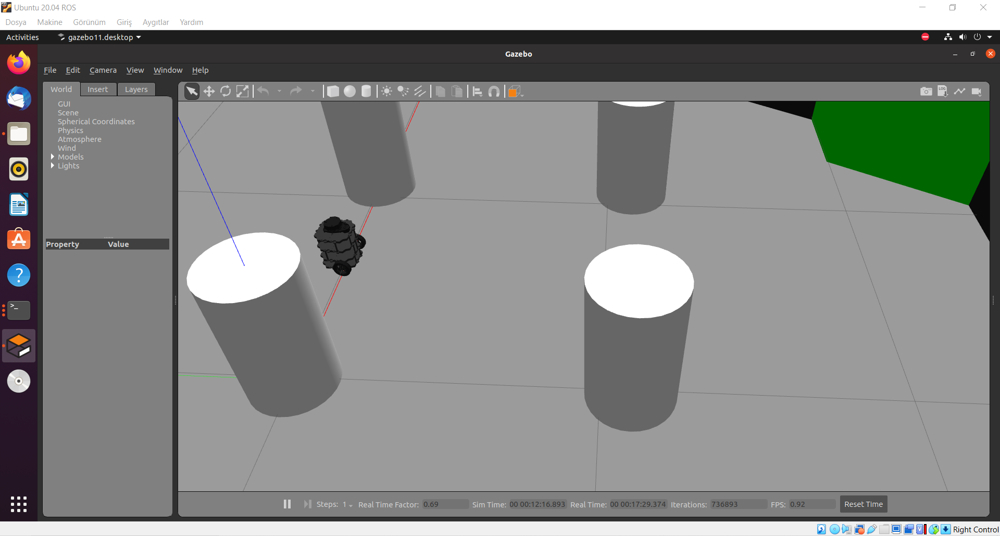
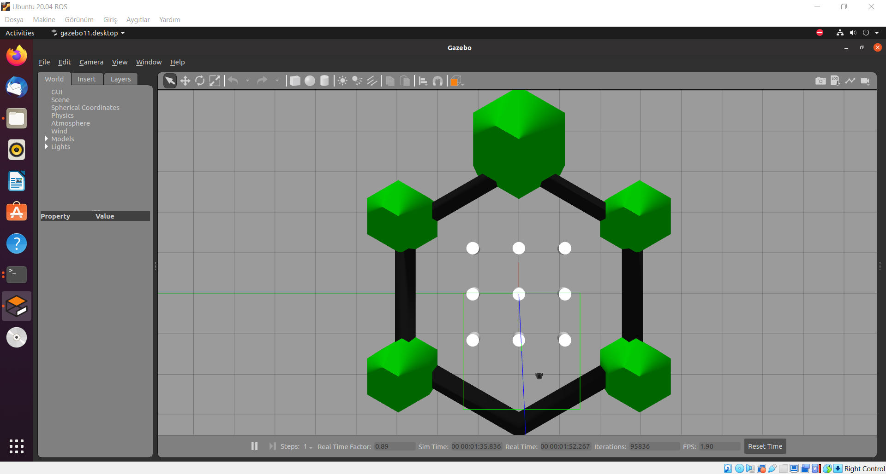
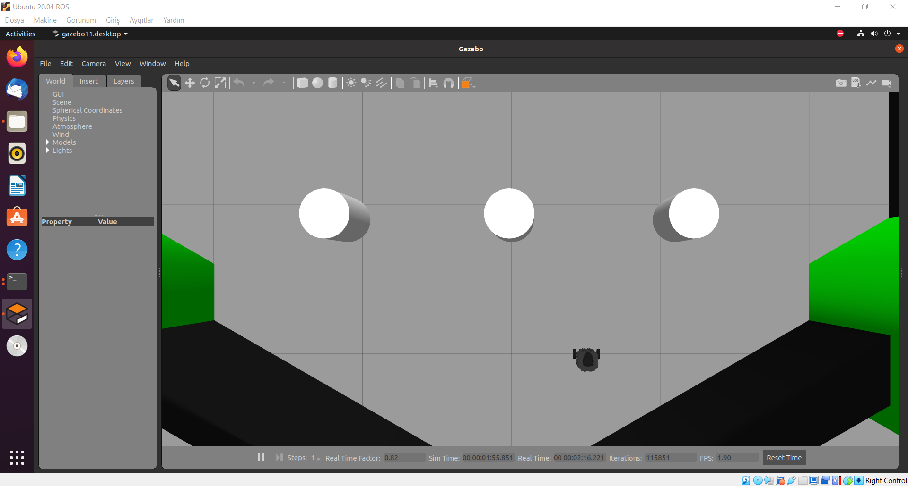

> 🇹🇷 **[Türkçe Versiyon İçin Tıklayınız / Click for Turkish Version](README_TR.md)**

# ROS Based Multithreaded Gap Finding Robot 🤖

<p align="left">
  
  
  
  
</p>

---



## 📖 Table of Contents
- [Project Summary](#-project-summary)
- [Key Features](#-key-features)
- [Algorithm and Logic](#-algorithm-and-logic)
  - [1. Data Preprocessing and Noise Filtering](#1-data-preprocessing-and-noise-filtering)
  - [2. Gap Finding Strategy](#2-gap-finding-strategy)
  - [3. Dynamic Velocity Control (Exponential Velocity Profiling)](#3-dynamic-velocity-control-exponential-velocity-profiling)
- [Software Architecture (Multithreading)](#-software-architecture-multithreading)
- [Source Code](#-source-code)
- [Usage](#-usage)
  - [1. Requirements](#1-requirements)
  - [2. Launching and Running Simulation](#2-launching-and-running-simulation)
  - [3. Operator Commands](#3-operator-commands)
- [Simulation Results](#-simulation-results)
- [File Structure](#-file-structure)
- [Future Improvements](#-future-improvements)
- [References](#-references)

---

## 🚀 Project Summary
This project is an autonomous mobile robot navigation system based on Lidar sensors, developed using **ROS (Robot Operating System)** and the **Gazebo** simulation environment. Unlike traditional stop-and-turn obstacle avoidance algorithms, this work utilizes a **Gap Finding** strategy, enabling the robot to dynamically determine the optimal trajectory in unknown and unstructured indoor environments.

Tested on the **TurtleBot3** platform, the system delivers real-time response rates and safety even under high computational loads, thanks to its **Multithreaded** architecture that decouples sensor data processing, decision-making, and motor control processes.

## ✨ Key Features
* **Reactive Navigation (Gap Finding Strategy):** Without requiring a pre-defined map, the system processes instantaneous data from the Lidar sensor to detect the widest and deepest gap (Max Gap) in the environment, allowing the robot to generate a smooth, non-stop trajectory.
* **Multithreaded Architecture (Concurrency):** Minimizes control latency by executing sensor reading (Perception), navigation planning (Planning), and user interface (UI) operations in separate threads.
* **Dynamic Velocity Control (Exponential Velocity):** Adjusts the robot's speed based on the distance to an obstacle using an exponential function rather than a linear one, preventing mechanical stress caused by sudden stops and ensuring a human-like smooth drive.
* **Noise Filtering and Data Processing:** Filters out erroneous data (Inf, NaN) and reflection noise below 0.15m from the sensor, preventing the robot from being affected by ghost obstacles (false positives).
* **Safety and Emergency Protocols:** A safety layer (Watchdog) running independently of the navigation algorithm overrides all autonomous decisions to immediately stop the robot and execute a reverse maneuver if an obstacle is detected within the critical distance of 0.25m.
 
## 🧠 Algorithm and Logic

The robot's decision mechanism is built on a hybrid structure that analyzes the environment's geometry and observes kinematic constraints, rather than relying on simple reactive rules.




### 1. Data Preprocessing and Noise Filtering
Lidar sensors can produce erroneous data (noise) due to reflections from glass surfaces or dust particles. In the first stage of the algorithm, raw data (`scan`) goes through the following steps
* **NaN  Inf Cleaning:** Undefined or infinite values returned by the sensor are clamped to the maximum range value (3.5m) to prevent processing errors.
* **Close Range Filter:** Readings below 0.15m (potential detection of the robot's own cables or sensor errors) are treated as noise and filtered out.
* **Panorama Merging:** The [0-90] (Left) and [270-360] (Right) degree data arrays of the TurtleBot3 Lidar structure are concatenated to form a single continuous 180-degree panorama array in front of the robot.

### 2. Gap Finding Strategy
The algorithm searches for the best navigable path (Best Gap) rather than just avoiding obstacles. This process follows these steps
1.  **Gap Detection:** The Lidar array is scanned to group consecutive free indices (those above the threshold).
2.  **Heuristic Scoring:** Each detected gap is scored not only by its width but also by its depth (distance to the goal). This ensures the robot prefers narrow but long corridors over wide but short dead ends.
3.  **Target Angle Calculation:** The mid-point of the highest-scoring gap is determined as the robot's new target angle ($theta_{target}$).

### 3. Dynamic Velocity Control (Exponential Velocity Profiling)
To smooth the robot's movements and prevent mechanical stress caused by sudden stops, the velocity profile is modeled with an exponential function instead of a linear one.

As the robot approaches an obstacle, its speed decreases according to the following formula

$$V(d) = V_{max} cdot (1 - e^{-k cdot (d - d_{min})})$$

* $V(d)$ Current velocity of the robot
* $V_{max}$ Maximum velocity (0.26 m/s)
* $d$ Instantaneous distance to obstacle
* $d_{min}$ Safe stopping distance (0.25m)
* $k$ Braking stiffness coefficient

This approach allows the robot to proceed aggressively when far from obstacles, but decelerate with human-like smoothness when entering the critical distance ($d  0.7m$).

## 🏗 Software Architecture (Multithreading)

In autonomous systems, sensor data processing and decision-making processes can require intensive computational power. In traditional single-loop architectures, this load can cause latency in the robot's control loop.

In this project, a concurrent structure based on the Producer-Consumer design pattern has been established using Python's `threading` library to minimize system response time and ensure uninterrupted data flow.



The system operates on 3 main threads

* **1. Perception Layer (Sensor Thread):**
    * Runs continuously in the background and listens for Lidar (`scan`) data via ROS.
    * Since it is independent of the main navigation loop, sensor data remains up-to-date even while the robot is performing calculations.

* **2. Decision Layer (Navigation Thread - The Brain):**
    * Retrieves the most up-to-date sensor data from shared memory.
    * Performs mathematical calculations (Gap Finding, Velocity Profiling) and sends velocity commands to the robot's motor drivers (`cmd_vel`).

* **3. User Interface (Main Thread):**
    * Listens for operator commands (`g` Go, `s` Stop, `e` Exit) via the terminal.
    * Decoupling this layer ensures that Emergency Stop (Kill Switch) commands are processed without delay, even when the navigation algorithm is under heavy load.

 **Thread Safety:** The `threading.Lock()` (Mutex) mechanism is used to guarantee data integrity and prevent Race Condition errors during data exchange between threads.
<br>

## 💻 Source Code
Click the heading below to examine the full Python implementation of the architecture.

<details>
  <summary><b>📜 Click to View Source Code</b></summary>
  <br>

```python
#!/usr/bin/env python3
# -*- coding: utf-8 -*-

"""
=====================================================================================
                    TECHNICAL CONFIGURATION EXPLANATION
=====================================================================================
Line 1 (Shebang - #!/usr/bin/env python3):
   - This line indicates to the Linux/ROS environment that this file is a "Python 3"
     script and must be executed with the appropriate interpreter.
   - The '/usr/bin/env' command dynamically locates the Python 3 path in the system,
     ensuring the code runs seamlessly across different computers (portability).
   - Thanks to this line, the file can be executed directly via './filename.py' 
     or the 'rosrun' command.

Line 2 (Encoding - # -*- coding: utf-8 -*-):
   - Specifies to the Python interpreter that the file's character encoding is UTF-8.
   - This configuration ensures that special characters can be used within the code 
     and comments without raising errors or causing corruption.
=====================================================================================

=====================================================================================
"""

#####################################################################################
#####################################################################################
##                                                                                 ##
## PROJECT      : LIDAR SENSOR-BASED AUTONOMOUS OBSTACLE AVOIDANCE ROBOT DESIGN    ##
##                IN ROS AND GAZEBO SIMULATION ENVIRONMENT                         ##
## ARCHITECTURE : MULTITHREADED & REACTIVE CONTROL                                 ##
## DEVELOPER    : ALI OZKAN                                                        ##
##                                                                                 ##
#####################################################################################
#####################################################################################

#####################################################################################
## LICENSE   : CC BY-NC-SA 4.0 (Attribution-NonCommercial-ShareAlike)              ##
## COPYRIGHT : 2026, Ali Özkan                                                     ##
## NOTICE    : This code cannot be used for commercial purposes.                   ##
#####################################################################################

"""
=====================================================================================
                                    DESCRIPTION
=====================================================================================
This code includes "Gap Finding" and "Dynamic Velocity" algorithms. Additionally, 
to enhance user experience, ROS communication and Navigation logic are executed 
in separate threads.
=====================================================================================

=====================================================================================
"""

# --- IMPORTING LIBRARIES ---
import time
import threading
import math
import sys
import numpy as np
import rospy
from sensor_msgs.msg import LaserScan
from geometry_msgs.msg import Twist

# --- GLOBAL VARIABLES AND STATE FLAGS ---
global scan_data        # Global variable holding Lidar data
global is_navigating    # Robot movement state (True/False)
global system_active    # Main loop status of the program
global thread_lock      # Lock to prevent data read/write race conditions

scan_data = None
is_navigating = False
system_active = True
thread_lock = threading.Lock()

# --- ROBOT PHYSICAL PARAMETERS ---
ROBOT_WIDTH = 0.50          # Robot width (Including safety margin - meters)
MAX_SPEED_LINEAR = 0.26     # Maximum linear velocity (m/s)
MAX_SPEED_ANGULAR = 1.82    # Maximum angular velocity (rad/s)
MIN_STOP_DIST = 0.25        # Emergency stop distance (m)
GAP_THRESHOLD = 0.80        # Depth required for an interval to be considered a "gap" (m)

# --- INITIALIZING ROS NODE ---
rospy.init_node('otonom_navigasyon', anonymous=True)
pub = rospy.Publisher('/cmd_vel', Twist, queue_size=10)
move = Twist()


# --- MATHEMATICAL FUNCTIONS (Algorithm Details) ---

def calculate_alpha(distance):
    """
    [Project Equation]: Calculates the minimum angular width (alpha) required 
    for the robot to pass through obstacles at a certain distance.
    
    Formula: alpha = 2 * arctan( Robot_Width / (2 * Distance) )
    """
    if distance <= 0: 
        return 90.0 # Return max angle if distance is 0 (Error protection)
    
    # Calculation in radians
    alpha_rad = 2 * math.atan(ROBOT_WIDTH / (2 * distance))
    
    # Convert to degrees
    alpha_deg = math.degrees(alpha_rad)
    
    # Adding +1 degree as safety margin (Thesis recommendation)
    return alpha_deg + 1.0


def calculate_dynamic_velocity(front_distance):
    """
    [Project Equation]: Reduces speed exponentially rather than linearly as the 
    robot approaches an obstacle. This ensures the robot stops smoothly.
    
    Formula: V = V_max * (1 - exp( -k * (d - d_min) ))
    """
    if front_distance < MIN_STOP_DIST:
        return 0.0
    
    # Velocity profile calculation
    # Coefficient (1.0) determines braking stiffness
    velocity = MAX_SPEED_LINEAR * (1 - math.exp(-(front_distance - MIN_STOP_DIST)))
    
    # Saturation
    if velocity > MAX_SPEED_LINEAR:
        velocity = MAX_SPEED_LINEAR
    elif velocity < 0.0:
        velocity = 0.0
        
    return velocity


def get_clean_scan_data(raw_msg):
    """
    Cleans raw data coming from the Lidar sensor.
    1. Cleans infinite (inf) values.
    2. Cleans erroneous (NaN) values.
    3. Filters very close noise values (under 0.15m).
    """
    clean_ranges = []
    for r in raw_msg.ranges:
        if math.isinf(r) or math.isnan(r):
            clean_ranges.append(3.5) # Assign max range
        elif r < 0.15:
            # Lidar sometimes detects the robot's own cables; to prevent this,
            # we consider very close values as "far" (Filtering).
            clean_ranges.append(3.5) 
        else:
            clean_ranges.append(r)
    return clean_ranges


def find_best_gap(ranges):
    """
    [Gap Finding Algorithm]: Searches for the widest and deepest gap around the robot.
    It does not just look left or right; it scans the entire panorama to find the safest route.
    
    Return: (Target Angle [Radians], Target Distance [Meters])
    """
    # Merging right and left sectors for processing convenience.
    # Turtlebot3 Lidar Structure: [0-90] Left, [270-360] Right.
    # Combined Panorama: [Right Side (90 deg)] + [Left Side (90 deg)]
    panorama = ranges[270:360] + ranges[0:90]
    
    max_score = -1          # Max gap score
    best_angle_index = -1   # Midpoint of the best gap
    current_gap_start = -1  # Gap start index
    
    # Scan panorama from start to finish
    for i in range(len(panorama)):
        dist = panorama[i]
        
        # If distance is greater than threshold, this is a "gap".
        if dist > GAP_THRESHOLD:
            if current_gap_start == -1:
                current_gap_start = i # A new gap started
        else:
            # Gap ended or obstacle detected
            if current_gap_start != -1:
                # Analyze and score the gap
                gap_width = i - current_gap_start
                
                # Heuristic Scoring: Width * Average Depth
                # (Wide and deep gaps get higher scores)
                avg_depth = sum(panorama[current_gap_start:i]) / gap_width
                score = gap_width * avg_depth
                
                if score > max_score:
                    max_score = score
                    # Select the exact center of the gap as target
                    best_angle_index = current_gap_start + (gap_width // 2)
                
                current_gap_start = -1 # Reset counter

    # If no suitable gap is found (e.g., Dead End)
    if best_angle_index == -1:
        return None, 0.0
    
    # Convert found index to angle relative to robot
    # Panorama indexed 0..180. Index 90 is directly in front (0 degrees).
    # Index 0 = -90 degrees (Right), Index 180 = +90 degrees (Left).
    target_angle_deg = best_angle_index - 90
    target_dist = panorama[best_angle_index]
    
    return math.radians(target_angle_deg), target_dist


# --- THREADS ---

def ros_callback_thread(msg):
    """
    Callback function that continuously updates Lidar data from ROS.
    Runs independently of the main loop, so data flow is never interrupted.
    """
    global scan_data
    with thread_lock:
        scan_data = msg

def navigation_control_thread():
    """
    [THE BRAIN]: Thread that makes robot movement decisions.
    Activates when user presses 'g', stops with 's'.
    Runs independently (Non-blocking) of terminal commands.
    """
    global is_navigating, system_active, scan_data
    
    rate = rospy.Rate(10) # 10 Hz (10 decisions per second)
    
    print(">>> Navigation Control Module Loaded. (Standing by...)")
    
    while system_active and not rospy.is_shutdown():
        # Wait if navigation is not active or data hasn't arrived
        if not is_navigating or scan_data is None:
            time.sleep(0.1)
            continue
            
        # Copy global data (For thread safety)
        with thread_lock:
            current_scan = get_clean_scan_data(scan_data)
        
        # Front Safety Distance (20-degree angle directly in front of robot)
        front_distance = min(current_scan[0:10] + current_scan[350:360])
        
        linear_x = 0.0
        angular_z = 0.0
        log_status = ""
        
        # --- FINITE STATE MACHINE ---
        
        # STATE 1: EMERGENCY BRAKE (Critical Distance)
        if front_distance < MIN_STOP_DIST:
            log_status = "[STATUS]: EMERGENCY STATE (Reverse Escape)"
            linear_x = -0.10 # Slowly reverse
            angular_z = 0.0
            
        # STATE 2: GAP ANALYSIS AND MOVEMENT
        else:
            target_angle, target_dist = find_best_gap(current_scan)
            
            if target_angle is None:
                # No place to go (Cornered)
                log_status = "[STATUS]: STUCK (Rotating)"
                linear_x = 0.0
                angular_z = 0.6 # Rotate in place
            else:
                # Calculate dynamic velocity
                linear_x = calculate_dynamic_velocity(front_distance)
                
                # Proportional (P-Control) rotation towards target angle
                angular_z = target_angle * 1.5 
                
                # Reduce linear speed during sharp turns to prevent drifting
                if abs(angular_z) > 0.5:
                    linear_x *= 0.5
                
                degree_display = math.degrees(target_angle)
                log_status = f"[STATUS]: CRUISING (Target: {degree_display:.1f} deg)"

        # Send calculated velocities to robot
        move.linear.x = linear_x
        move.angular.z = angular_z
        pub.publish(move)
        
        # Print status to terminal (Flows continuously, doesn't erase previous line)
        print(f"{log_status} | Speed: {linear_x:.2f} m/s | Front Dist: {front_distance:.2f}m")
        
        rate.sleep()


def stop_robot_emergency():
    """Safety function to stop the robot immediately."""
    move.linear.x = 0.0
    move.angular.z = 0.0
    pub.publish(move)
    pub.publish(move) # Send twice to ensure delivery
    print("\n!!! ROBOT EMERGENCY STOPPED !!!\n")


# --- MAIN PROGRAM ---

if __name__ == '__main__':
    try:
        # 1. Start ROS Lidar Listener Thread
        # This thread continuously updates Lidar data in the background.
        ros_thread = threading.Thread(target=rospy.Subscriber, args=('/scan', LaserScan, ros_callback_thread))
        ros_thread.daemon = True # Closes when main program closes
        ros_thread.start()
        
        # 2. Start Navigation Logic Thread
        # This thread manages autonomous movements of the robot.
        nav_thread = threading.Thread(target=navigation_control_thread)
        nav_thread.daemon = True
        nav_thread.start()
        
        # 3. User Interface (Main Thread)
        # This only waits for user command, never freezes.
        print("==================================================")
        print("        OBSTACLE AVOIDANCE ROBOT DESIGN           ")
        print("==================================================")
        print("          AUTONOMOUS NAVIGATION SYSTEM            ")
        print("     [ MULTITHREADED & REACTIVE CONTROL ]         ")
        print("==================================================")
        print(" COMMAND LIST:")
        print("  g  -> GO    (Activate navigation)")
        print("  s  -> STOP  (Stop robot immediately)")
        print("  e  -> EXIT  (Close program and terminal)")
        print("==================================================")
        
        while not rospy.is_shutdown():
            # input() function blocks the main thread but other threads continue running.
            # This allows you to type here even while the robot is moving.
            user_input = input("\nEnter Command (g/s/e) > ").strip().lower()
            
            if user_input == 'g':
                if not is_navigating:
                    print(">>> SYSTEM STARTING...")
                    is_navigating = True
                else:
                    print(">>> WARNING: System is already running!")
                    
            elif user_input == 's':
                if is_navigating:
                    print(">>> STOP COMMAND RECEIVED!")
                    is_navigating = False
                    stop_robot_emergency()
                else:
                    print(">>> Robot is already stopped.")
            
            elif user_input == 'e':
                print(">>> EXITING...")
                is_navigating = False
                system_active = False # Terminate other threads
                stop_robot_emergency()
                time.sleep(1) # Wait for threads to close
                sys.exit() # Exit program
                
            else:
                print(">>> ERROR: Invalid command! Please enter 'g', 's' or 'e'.")
                
    except rospy.ROSInterruptException:
        pass
    except KeyboardInterrupt:
        stop_robot_emergency()
        sys.exit()
```

</details>

## 🎮 Usage

This project was developed on **Ubuntu 20.04 LTS** operating system with **ROS Noetic**. You can prepare the working environment by following the steps below.

### 1. Requirements

* **Operating System:** Ubuntu 20.04 LTS (Focal Fossa)
* **ROS Version:** Noetic Ninjemys
* **Simulator:** Gazebo 11
* **Programming Language:** Python 3.8+
* **Required ROS Packages:**
    * `turtlebot3`
    * `turtlebot3_simulations`
    * `rospy`
    * `geometry_msgs`
    * `sensor_msgs`

### 2. Launching and Running Simulation
The project's operation video and usage details are shown here

[](https://www.youtube.com/watch?v=VIDEO_ID_BURAYA_YAZILACAK)

*(Note: Click on the image to watch the video.)*

### 3. Operator Commands
When the program is started, the terminal interface will wait for commands from you. Since the algorithm has a Multithreaded UI structure, you can issue the following commands instantaneously even while the robot is in motion

| Tuş | Komut | Açıklama |
| :---: | :--- | :--- |
| **g** | **Go** | Activates the navigation algorithm and autonomous driving.  |
| **s** | **Stop** | Emergency Stop (Kill Switch) Instantly stops the robot and locks the motors. |
| **e** | **Exit** | Safely closes all threads and exits the program.  |

## 📊 Simulation Results

The developed algorithm was subjected to comprehensive tests on the TurtleBot3 World map within the Gazebo physics engine. Technical data and scenario analyses obtained are as follows

### 1. Free Drive and Acceleration Analysis
When the distance in front of the robot is above **2.0 meters**, the `calculate_dynamic_velocity` function engages, accelerating the robot to a maximum speed of **0.26 m/s**.
* **Observation:** The robot followed a stable path in straight corridors without any oscillation.
* **Velocity Profile:** Exponential increase was observed during acceleration and deceleration instead of linear, which prevented wheel slippage.



### 2. Obstacle Avoidance and Gap Selection
The system's response time and maneuverability were analyzed when an obstacle appeared in front of the robot (Distance < 0.8m).
* **Dynamic Braking:** When approaching within 0.5m of an obstacle, the speed was automatically reduced to a safe level of **0.10 m/s**.
* **Smart Route Selection:* The robot preferred not just the widest gap, but the **deepest** gap. For instance, when the left side was blocked, it detected the opening on the right and executed a curved maneuver non-stop.





### 3. System Performance and Stability
The performance advantages provided by the multithreaded architecture were verified via terminal outputs
* **Response Time (Latency):** No latency was experienced in the motor control loop during sensor data processing.
* **Emergency Stop:** The "Stop" (s) command sent by the operator was processed in under **100 milliseconds**, instantly locking the robot.
* **Endurance:** The robot successfully navigated collision-free for **10 minutes** in a complex environment filled with obstacles.





## 📂 File Structure

The project directory is organized as follows:

```text
.
├── images/                          # Visual assets (Diagrams & Screenshots)
│   ├── Algorithm_Flow_Chart_eng.png # Algorithm flowchart (English)
│   ├── Algorithm_Flow_Chart_tr.png  # Algorithm flowchart (Turkish)
│   ├── Block_Diagram_eng.png        # System architecture diagram (English)
│   ├── Block_Diagram_tr.png         # System architecture diagram (Turkish)
│   ├── Gazebo_1.png                 # Simulation environment view
│   └── Sim_*.png                    # Simulation test results (1-6)
├── src/                             # Source code directory
│   ├── *_eng.py                     # Main navigation node (English Comments)
│   └── *_tr.py                      # Main navigation node (Turkish Comments)
├── README.md                        # Primary Documentation (English)
└── README_tr.md                     # Project Documentation (Turkish)
```

---

## 🔮 Future Improvements

This project currently possesses a reactive (mapless) architecture. To enhance the system's capabilities, the following improvements are planned for future stages

* **Sensor Fusion (RGB-D Integration):** The current Lidar sensor may struggle to detect low obstacles such as glass surfaces or table legs. Integration of a depth camera to combine with Lidar data (Sensor Fusion) is targeted.
* **SLAM Integration:** Integration of **Gmapping** or **Hector SLAM** algorithms is planned to enable the robot to map the traversed environment (Mapping) and plan the shortest path to a global destination point.

## 📚 References

The following academic sources and literature studies were utilized in the development of this project

* **Sezer, V., & Gokasan, M. (2012).** "A novel obstacle avoidance algorithm: Follow the Gap Method". *Robotics and Autonomous Systems*, 60(9), 1123-1134.
* **Fox, D., Burgard, W., & Thrun, S. (1997).** "The dynamic window approach to collision avoidance". *IEEE Robotics & Automation Magazine*, 4(1), 23-33.
* **Quigley, M., Gerkey, B., & Smart, W. D. (2015).** *Programming Robots with ROS: A Practical Introduction to the Robot Operating System*. O'Reilly Media.
* **Siegwart, R., & Nourbakhsh, I. R. (2011).** *Introduction to Autonomous Mobile Robots*. MIT Press.
* **Koenig, N., & Howard, A. (2004).** "Design and use environments for Gazebo, an open-source 3D robot simulator". *IEEE/RSJ International Conference on Intelligent Robots and Systems (IROS)*.
