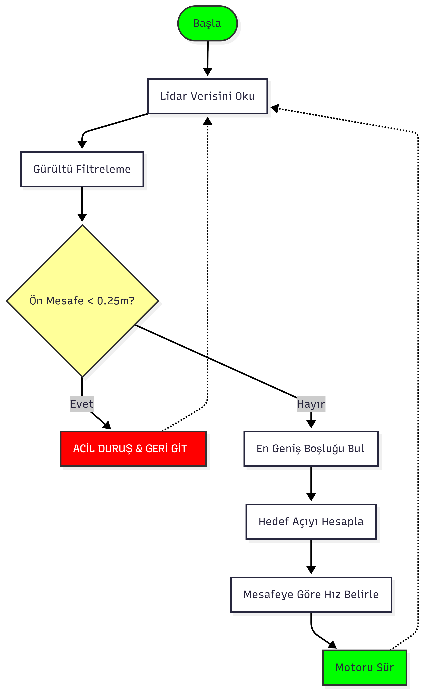
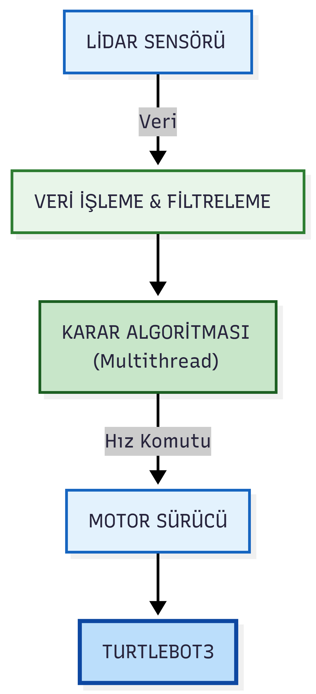

> 🇺🇸 **[Click for English Version / İngilizce Versiyon İçin Tıklayınız](README.md)**

# ROS Tabanlı Çoklu İş Parçacıklı Reaktif Navigasyonlu Robot 🤖

<p align="left">
  
  
  
  
</p>

---


## 📖 İçindekiler (Table of Contents)
- [Proje Özeti](#-proje-özeti)
- [Temel Özellikler](#-temel-özellikler)
- [Algoritma ve Mantık](#-algoritma-ve-mantık)
  - [1. Veri Ön Işleme ve Gürültü Filtreleme](#1-veri-ön-işleme-ve-gürültü-filtreleme)
  - [2. Boşluk Takibi (Gap Finding Strategy)](#2-boşluk-takibi-gap-finding-strategy)
  - [3. Dinamik Hız Kontrolü (Exponential Velocity Profiling)](#3-dinamik-hız-kontrolü-exponential-velocity-profiling)
- [Yazılım Mimarisi (Multithreading)](#-yazılım-mimarisi-multithreading)
- [Kaynak Kod](#-kaynak-kod)
- [Kullanım](#-kullanım)
  - [1. Gereksinimler](#1-gereksinimler)
  - [2. Simülasyonu Başlatma ve Otonom Sürüşü Çalıştırma](#2-simülasyonu-başlatma-ve-otonom-sürüşü-çalıştırma)
  - [3. Operatör Komutları](#3-operatör-komutları)
- [Simülasyon Sonuçları](#-simülasyon-sonuçları)
- [Dosya Yapısı](#-dosya-yapısı)
- [Gelecek Geliştirmeler](#-gelecek-geliştirmeler)
- [Referanslar](#-referanslar)

---

## 🚀 Proje Özeti
Bu proje, **ROS (Robot Operating System)** ve **Gazebo** simülasyon ortamı kullanılarak geliştirilmiş, Lidar sensör tabanlı otonom bir mobil robot navigasyon sistemidir. Geleneksel "engelden dur-dön" algoritmalarının aksine, bu çalışma **"Boşluk Bulma" (Gap Finding)** stratejisini kullanarak robotun bilinmeyen ve yapılandırılmamış iç mekanlarda en uygun rotayı dinamik olarak belirlemesini sağlar.

**TurtleBot3** platformu üzerinde test edilen sistem, sensör verilerini işleme, karar verme ve motor kontrol süreçlerini birbirinden ayıran **"Çoklu İş Parçacığı" (Multithreaded)** mimarisi sayesinde, yüksek hesaplama yükü altında bile gerçek zamanlı tepki hızı ve güvenlik sunar.

## ✨ Temel Özellikler
* **Reaktif Navigasyon (Gap Finding Strategy):** Önceden tanımlanmış bir haritaya ihtiyaç duymadan, Lidar sensöründen gelen anlık verilerle ortamdaki en geniş ve derin boşluğu (Max Gap) tespit ederek robotun duraksamadan akıcı bir rota çizmesini sağlar.
* **Multithreaded Mimari (Eşzamanlılık):** Sensör okuma (Perception), navigasyon planlaması (Planning) ve kullanıcı arayüzü (UI) işlemlerini ayrı iş parçacıklarında (threads) yürüterek kontrol gecikmelerini (latency) minimize eder.
* **Dinamik Hız Kontrolü (Exponential Velocity):** Robotun engele olan mesafesine göre hızını lineer değil, **üstel (exponential)** bir fonksiyonla ayarlayarak ani duruşların yarattığı mekanik stresi önler ve "insansı" (smooth) bir sürüş sağlar.
* **Gürültü Filtreleme ve Veri İşleme:** Sensörden gelen hatalı verileri (Inf, NaN) ve 0.15m altındaki yansıma gürültülerini filtreleyerek, robotun "hayalet engellerden" (false positives) etkilenmesini engeller.
* **Güvenlik ve Acil Durum Protokolleri:** Navigasyon algoritmasından bağımsız çalışan bir güvenlik katmanı (Watchdog), 0.25m kritik mesafede bir engel tespit edildiğinde tüm otonom kararları ezerek robotu anında durdurur ve geri manevra yaptırır.

## 🧠 Algoritma ve Mantık

Robotun karar mekanizması, basit reaktif kurallar yerine, ortamın geometrisini analiz eden ve kinematik kısıtları gözeten hibrid bir yapı üzerine kurulmuştur.




### 1. Veri Ön Işleme ve Gürültü Filtreleme
Lidar sensörleri cam yüzeylerden yansıma veya toz zerrecikleri nedeniyle hatalı veriler (noise) üretebilir. Algoritmanın ilk aşamasında ham veri (`/scan`) şu adımlardan geçer:
* **NaN / Inf Temizliği:** Sensörden dönen tanımsız veya sonsuz değerler, işlem hatasını önlemek için maksimum menzil değerine (3.5m) çekilir.
* **Yakın Mesafe Filtresi:** 0.15m altındaki okumalar (robotun kendi kabloları veya sensör hatası) gürültü olarak kabul edilip filtrelenir.
* **Panorama Birleştirme:** TurtleBot3 Lidar yapısındaki [0-90] (Sol) ve [270-360] (Sağ) derecelik veriler birleştirilerek, robotun önündeki 180 derecelik tek parça panorama dizisi oluşturulur.

### 2. Boşluk Takibi (Gap Finding Strategy)
Algoritma, engellerden kaçmak yerine "gidilebilir en iyi yolu" (Best Gap) arar. Bu süreç şu adımları izler:
1.  **Boşluk Tespiti:** Lidar dizisi taranarak ardışık "boş" indisler (threshold üzerinde olanlar) gruplanır.
2.  **Sezgisel Puanlama (Heuristic Scoring):** Bulunan her boşluk sadece genişliğine göre değil, derinliğine (hedefe olan uzaklığına) göre de puanlanır. Bu sayede robot, geniş ama kısa çıkmaz sokaklar yerine, dar ama uzun koridorları tercih eder.
3.  **Hedef Açı Hesabı:** En yüksek puanlı boşluğun orta noktası (mid-point), robotun yeni hedef açısı ($\theta_{target}$) olarak belirlenir.

### 3. Dinamik Hız Kontrolü (Exponential Velocity Profiling)
Robotun hareketlerini yumuşatmak ve ani duruşların yarattığı mekanik stresi önlemek amacıyla, hız profili lineer yerine **üstel (exponential)** bir fonksiyonla modellenmiştir.

Robot engele yaklaştıkça hızı şu formüle göre azalır:

$$V(d) = V_{max} \cdot (1 - e^{-k \cdot (d - d_{min})})$$

* $V(d)$: Robotun o anki hızı
* $V_{max}$: Maksimum hız (0.26 m/s)
* $d$: Engele olan anlık mesafe
* $d_{min}$: Güvenli duruş mesafesi (0.25m)
* $k$: Frenleme sertlik katsayısı

Bu yaklaşım, robotun engellere uzaktayken agresif ilerlemesini, kritik mesafeye ($d < 0.7m$) girdiğinde ise "insansı" bir yumuşaklıkla yavaşlamasını sağlar.

## 🏗 Yazılım Mimarisi (Multithreading)

Otonom sistemlerde sensör verilerinin işlenmesi ve karar verme süreçleri yoğun işlem gücü gerektirebilir. Geleneksel "tek döngülü" (single-loop) mimarilerde bu yoğunluk, robotun kontrol döngüsünde gecikmelere (latency) neden olabilir.

Bu projede, sistemin tepki süresini minimize etmek ve veri akışını kesintisiz kılmak için Python'un `threading` kütüphanesi ile **"Üretici-Tüketici" (Producer-Consumer)** tasarım desenine dayalı eşzamanlı bir yapı kurulmuştur.



Sistem 3 ana iş parçacığı (Thread) üzerinde çalışır:

* **1. Algı Katmanı (Sensor Thread):**
    * Arka planda sürekli çalışır ve ROS üzerinden gelen Lidar (`/scan`) verilerini dinler.
    * Ana navigasyon döngüsünden bağımsız olduğu için, robot hesaplama yaparken bile sensör verisi her zaman güncel kalır.

* **2. Karar Katmanı (Navigation Thread - The Brain):**
    * Paylaşılan hafızadaki en güncel sensör verisini alır.
    * Matematiksel hesaplamaları (Gap Finding, Velocity Profiling) yaparak robotun motor sürücülerine (`/cmd_vel`) hız komutlarını gönderir.

* **3. Kullanıcı Arayüzü (Main Thread):**
    * Terminal üzerinden operatörden gelen komutları (`g`: Git, `s`: Dur, `e`: Çıkış) dinler.
    * Bu katmanın ayrılması, navigasyon algoritması ağır yük altındayken bile "Acil Durdurma" (Kill Switch) komutunun gecikmesiz işlenmesini sağlar.

> **Veri Güvenliği (Thread Safety):** İş parçacıkları arasındaki veri alışverişi sırasında oluşabilecek "Race Condition" hatalarını önlemek için `threading.Lock()` (Mutex) mekanizması kullanılarak veri bütünlüğü garanti altına alınmıştır.
<br>

## 💻 Kaynak Kod
Mimarinin Python üzerindeki tam uygulamasını incelemek için aşağıdaki başlığa tıklayınız.

<details>
  <summary><b>📜 Kaynak Kodu Görüntülemek İçin Tıklayın</b></summary>
  <br>

```python
#!/usr/bin/env python3
# -*- coding: utf-8 -*-

"""
=====================================================================================
                    TEKNİK YAPILANDIRMA AÇIKLAMASI
=====================================================================================
1. Satır (Shebang - #!/usr/bin/env python3):
   - Bu satır, Linux/ROS ortamına bu dosyanın bir "Python 3" betiği olduğunu ve
     uygun yorumlayıcı ile çalıştırılması gerektiğini bildirir.
   - '/usr/bin/env' komutu, sistemdeki Python 3 yolunu dinamik olarak bularak
     kodun farklı bilgisayarlarda (taşınabilirlik) sorunsuz çalışmasını sağlar.
   - Bu satır sayesinde dosya './dosya_adi.py' veya 'rosrun' komutuyla doğrudan
     çalıştırılabilir hale gelir.

2. Satır (Encoding - # -*- coding: utf-8 -*-):
   - Python yorumlayıcısına dosyanın karakter kodlamasının UTF-8 olduğunu belirtir.
   - Bu yapılandırma, kod içerisinde ve yorum satırlarında Türkçe karakterlerin
     (ç, ğ, ş, ö, ü, İ) hata almadan ve bozulmadan kullanılmasını garanti eder.
=====================================================================================

=====================================================================================
"""

#####################################################################################
#####################################################################################
##                                                                                 ##
## PROJE     : ROS VE GAZEBO SİMÜLASYON ORTAMINDA LİDAR SENSÖR TABANLI OTONOM      ##
##             ENGELDEN KAÇAN ROBOT TASARIMI                                       ##
## MİMARİ    : ÇOKLU İŞ PARÇACIĞI (MULTITHREADED) & REAKTİF KONTROL                ##
## PROGRAMCI : ALİ ÖZKAN                                                           ##
##                                                                                 ##
#####################################################################################
#####################################################################################

#####################################################################################
## LİSANS      : CC BY-NC-SA 4.0 (Atıf-Gayriticari-AynıLisanslaPaylaş)             ##
## TELİF HAKKI : 2026, Ali Özkan                                                   ##
## UYARI       : Bu kod ticari amaçlarla kullanılamaz.                             ##
#####################################################################################

"""
=====================================================================================
                                    AÇIKLAMA
=====================================================================================
Bu kod, "Gap Finding" (Boşluk Bulma) ve "Dynamic Velocity" (Dinamik Hız) 
algoritmalarını içerir. Ayrıca kullanıcı deneyimini artırmak için ROS iletişimi 
ve Navigasyon mantığı ayrı iş parçacıklarında (Thread) çalıştırılır.
=====================================================================================

=====================================================================================
"""

# --- KULLANILACAK KÜTÜPHANELER TANITILIYOR ---
import time
import threading
import math
import sys
import numpy as np
import rospy
from sensor_msgs.msg import LaserScan
from geometry_msgs.msg import Twist

# --- GLOBAL DEĞİŞKENLER VE DURUM BAYRAKLARI ---
global scan_data        # Lidar verisini tutan global değişken
global is_navigating    # Robotun hareket durumu (True/False)
global system_active    # Programın ana döngüsünün durumu
global thread_lock      # Veri okuma/yazma çakışmasını önlemek için kilit

scan_data = None
is_navigating = False
system_active = True
thread_lock = threading.Lock()

# --- ROBOT FİZİKSEL PARAMETRELERİ ---
ROBOT_WIDTH = 0.50          # Robot genişliği (Guvenlik payı dahil - metre)
MAX_SPEED_LINEAR = 0.26     # Maksimum dogrusal hiz (m/s)
MAX_SPEED_ANGULAR = 1.82    # Maksimum açısal hız (rad/s)
MIN_STOP_DIST = 0.25        # Acil duruş mesafesi (m)
GAP_THRESHOLD = 0.80        # Bir aralığın "boşluk" sayılması için gereken derinlik (m)

# --- ROS DÜĞÜM BAŞLATMA ---
rospy.init_node('otonom_navigasyon', anonymous=True)
pub = rospy.Publisher('/cmd_vel', Twist, queue_size=10)
move = Twist()


# --- MATEMATİKSEL FONKSİYONLAR (Algoritma Detaylari) ---

def calculate_alpha(distance):
    """
    [Proje Denklemi]: Robotun belirli bir mesafedeki (distance) engellerin arasından
    geçebilmesi için gereken minimum açisal genişliği (alpha) hesaplar.
    
    Formül: alpha = 2 * arctan( Robot_Genisligi / (2 * Mesafe) )
    """
    if distance <= 0: 
        return 90.0 # Mesafe 0 ise maksimum açı döndür (Hata koruması)
    
    # Radyan cinsinden hesaplama
    alpha_rad = 2 * math.atan(ROBOT_WIDTH / (2 * distance))
    
    # Dereceye çevirme
    alpha_deg = math.degrees(alpha_rad)
    
    # Güvenlik payı olarak +1 derece eklenir (Tez önerisi)
    return alpha_deg + 1.0


def calculate_dynamic_velocity(front_distance):
    """
    [Proje Denklemi]: Robot engele yaklaştıkça hızı doğrusal değil, üstel (exponential)
    olarak azaltır. Bu sayede robot engellere yaklaşırken daha yumuşak (smooth) durur.
    
    Formul: V = V_max * (1 - exp( -k * (d - d_min) ))
    """
    if front_distance < MIN_STOP_DIST:
        return 0.0
    
    # Hız profili hesabı
    # Katsayı (1.0) robotun frenleme sertliğini belirler
    velocity = MAX_SPEED_LINEAR * (1 - math.exp(-(front_distance - MIN_STOP_DIST)))
    
    # Sınırlandırma (Saturation)
    if velocity > MAX_SPEED_LINEAR:
        velocity = MAX_SPEED_LINEAR
    elif velocity < 0.0:
        velocity = 0.0
        
    return velocity


def get_clean_scan_data(raw_msg):
    """
    Lidar sensöründen gelen ham veriyi temizler.
    1. Sonsuz (inf) değerleri temizler.
    2. Hatalı (NaN) değerleri temizler.
    3. Çok yakın (0.15m altı) gürültü değerlerini filtreler.
    """
    clean_ranges = []
    for r in raw_msg.ranges:
        if math.isinf(r) or math.isnan(r):
            clean_ranges.append(3.5) # Maksimum menzil ata
        elif r < 0.15:
            # Lidar bazen robotun kendi kablosunu gorebilir, bunu engellemek icin
            # cok yakin degerleri "uzak" kabul ediyoruz (Filtreleme).
            clean_ranges.append(3.5) 
        else:
            clean_ranges.append(r)
    return clean_ranges


def find_best_gap(ranges):
    """
    [Gap Finding Algoritması]: Robotun etrafındaki en geniş ve en derin boşluğu arar.
    Sadece sağ veya sola bakmaz; tüm panoramayı tarayarak en güvenli rotayı bulur.
    
    Dönuüş: (Hedef Açı [Radyan], Hedef Mesafe [Metre])
    """
    # Veri işleme kolaylığı için sağ ve sol sektörü birleştiriyoruz.
    # Turtlebot3 Lidar Yapısı: [0-90] Sol, [270-360] Sağ.
    # Birleştirilmiş Panorama: [Sağ Taraf (90 derece)] + [Sol Taraf (90 derece)]
    panorama = ranges[270:360] + ranges[0:90]
    
    max_score = -1          # En iyi boşluk puanı
    best_angle_index = -1   # En iyi boşluğun orta noktası
    current_gap_start = -1  # Boşluk başlangıç indeksi
    
    # Panoramayı baştan sona tara
    for i in range(len(panorama)):
        dist = panorama[i]
        
        # Eğer mesafe eşik değerden büyükse, burası bir "boşluk"tur.
        if dist > GAP_THRESHOLD:
            if current_gap_start == -1:
                current_gap_start = i # Yeni bir bosluk basladi
        else:
            # Bosluk bitti veya engel var
            if current_gap_start != -1:
                # Boslugu analiz et ve puanla
                gap_width = i - current_gap_start
                
                # Heuristic Puanlama: Genislik * Ortalama Derinlik
                # (Genis ve derin bosluklar daha yuksek puan alir)
                avg_depth = sum(panorama[current_gap_start:i]) / gap_width
                score = gap_width * avg_depth
                
                if score > max_score:
                    max_score = score
                    # Boslugun tam ortasini hedef olarak sec
                    best_angle_index = current_gap_start + (gap_width // 2)
                
                current_gap_start = -1 # Sayaci sifirla

    # Eğer hiç uygun boşluk bulunamadıysa (Örn: Çıkmaz Sokak)
    if best_angle_index == -1:
        return None, 0.0
    
    # Bulunan indeksi robota göre açıya çevir
    # Panorama 0..180 arası indeksli. 90. indeks robotun tam önü (0 derece).
    # 0. indeks = -90 derece (Sağ), 180. indeks = +90 derece (Sol).
    target_angle_deg = best_angle_index - 90
    target_dist = panorama[best_angle_index]
    
    return math.radians(target_angle_deg), target_dist


# --- İŞ PARÇACIKLARI (THREADS) ---

def ros_callback_thread(msg):
    """
    ROS'tan gelen Lidar verisini sÜrekli gÜncelleyen callback fonksiyonu.
    Ana döngüden bağımsız çalışır, böylece veri akışı asla kesilmez.
    """
    global scan_data
    with thread_lock:
        scan_data = msg

def navigation_control_thread():
    """
    [ANA BEYİN]: Robotun hareket kararlarını veren thread.
    Kullanıcı 'g' tuşuna bastığında aktifleşir, 's' ile durur.
    Terminal komutlarından bağımsız (Non-blocking) çalışır.
    """
    global is_navigating, system_active, scan_data
    
    rate = rospy.Rate(10) # 10 Hz (Saniyede 10 karar)
    
    print(">>> Navigasyon Kontrol Modülü Yüklendi. (Beklemede...)")
    
    while system_active and not rospy.is_shutdown():
        # Eğer navigasyon aktif değilse veya veri gelmediyse bekle
        if not is_navigating or scan_data is None:
            time.sleep(0.1)
            continue
            
        # Global veriyi kopyala (Thread safe olması için)
        with thread_lock:
            current_scan = get_clean_scan_data(scan_data)
        
        # Ön Güvenlik Mesafesi (Robotun tam önündeki 20 derecelik açı)
        front_distance = min(current_scan[0:10] + current_scan[350:360])
        
        linear_x = 0.0
        angular_z = 0.0
        log_status = ""
        
        # --- DURUM MAKİNESİ (FINITE STATE MACHINE) ---
        
        # DURUM 1: ACİL FREN (Kritik Mesafe)
        if front_distance < MIN_STOP_DIST:
            log_status = "[DURUM]: ACIL DURUM (Geri Kacis)"
            linear_x = -0.10 # Yavasca geri git
            angular_z = 0.0
            
        # DURUM 2: BOŞLUK ANALİZİ VE HAREKET
        else:
            target_angle, target_dist = find_best_gap(current_scan)
            
            if target_angle is None:
                # Gidecek yer yoksa (Koseye sikisti)
                log_status = "[DURUM]: SIKISTI (Donus Yapiyor)"
                linear_x = 0.0
                angular_z = 0.6 # Oldugu yerde don
            else:
                # Dinamik hiz hesapla
                linear_x = calculate_dynamic_velocity(front_distance)
                
                # Hedef aciya dogru oransal (P-Control) donus
                angular_z = target_angle * 1.5 
                
                # Keskin donuslerde savrulmamak icin dogrusal hizi dusur
                if abs(angular_z) > 0.5:
                    linear_x *= 0.5
                
                degree_display = math.degrees(target_angle)
                log_status = f"[DURUM]: SEYIR (Hedef: {degree_display:.1f} dg)"

        # Hesaplanan hızları robota gönder
        move.linear.x = linear_x
        move.angular.z = angular_z
        pub.publish(move)
        
        # Durumu terminale yazdır (Alt alta akar, önceki satırı silmez)
        print(f"{log_status} | Hiz: {linear_x:.2f} m/s | On Mesafe: {front_distance:.2f}m")
        
        rate.sleep()


def stop_robot_emergency():
    """Robotu anında durduran güvenlik fonksiyonu."""
    move.linear.x = 0.0
    move.angular.z = 0.0
    pub.publish(move)
    pub.publish(move) # Garanti olsun diye iki kez gönder
    print("\n!!! ROBOT ACİL DURDURULDU !!!\n")


# --- ANA PROGRAM (MAIN) ---

if __name__ == '__main__':
    try:
        # 1. ROS Lidar Dinleyici Thread Başlat
        # Bu thread arka planda Lidar verisini sürekli günceller.
        ros_thread = threading.Thread(target=rospy.Subscriber, args=('/scan', LaserScan, ros_callback_thread))
        ros_thread.daemon = True # Ana program kapanınca bu da kapansın
        ros_thread.start()
        
        # 2. Navigasyon Mantığı Thread Başlat
        # Bu thread robotun otonom hareketlerini yönetir.
        nav_thread = threading.Thread(target=navigation_control_thread)
        nav_thread.daemon = True
        nav_thread.start()
        
        # 3. Kullanıcı Arayüzü (Ana Thread)
        # Burası sadece kullanıcıdan komut bekler, asla donmaz.
        print("==================================================")
        print("        ENGELDEN KAÇAN ROBOT TASARIMI             ")
        print("==================================================")
        print("          OTONOM NAVİGASYON SİSTEMİ               ")
        print("     [ MULTITHREADED & REAKTİF KONTROL ]          ")
        print("==================================================")
        print(" KOMUT LİSTESİ:")
        print("  g  -> BAŞLAT (Navigasyonu aktif et)")
        print("  s  -> DURDUR (Robotu anında durdur)")
        print("  e  -> CIKIŞ  (Programı ve terminali kapat)")
        print("==================================================")
        
        while not rospy.is_shutdown():
            # input() fonksiyonu main thread'i bloklar ama diger thread'ler calismaya devam eder.
            # Bu sayede robot hareket ederken bile buraya yazi yazabilirsin.
            user_input = input("\nKomut Giriniz (g/s/e) > ").strip().lower()
            
            if user_input == 'g':
                if not is_navigating:
                    print(">>> SİSTEM BASLATILIYOR...")
                    is_navigating = True
                else:
                    print(">>> UYARI: Sistem zaten calisiyor!")
                    
            elif user_input == 's':
                if is_navigating:
                    print(">>> DURDURMA KOMUTU ALINDI!")
                    is_navigating = False
                    stop_robot_emergency()
                else:
                    print(">>> Robot zaten duruyor.")
            
            elif user_input == 'e':
                print(">>> CIKIS YAPILIYOR...")
                is_navigating = False
                system_active = False # Diger thread'leri sonlandir
                stop_robot_emergency()
                time.sleep(1) # Thread'lerin kapanmasi icin bekle
                sys.exit() # Programdan cik
                
            else:
                print(">>> HATA: Gecersiz komut! Lutfen 'g', 's' veya 'e' giriniz.")
                
    except rospy.ROSInterruptException:
        pass
    except KeyboardInterrupt:
        stop_robot_emergency()
        sys.exit()
```

</details>

## 🎮 Kullanım

Bu proje **Ubuntu 20.04 LTS** işletim sistemi üzerinde **ROS Noetic** sürümü ile geliştirilmiştir. Aşağıdaki adımları takip ederek çalışma ortamını hazırlayabilirsiniz.

### 1. Gereksinimler

* **İşletim Sistemi:** Ubuntu 20.04 LTS (Focal Fossa)
* **ROS Sürümü:** Noetic Ninjemys
* **Simülatör:** Gazebo 11
* **Programlama Dili:** Python 3.8+
* **Gerekli ROS Paketleri:**
    * `turtlebot3`
    * `turtlebot3_simulations`
    * `rospy`
    * `geometry_msgs`
    * `sensor_msgs`

### 2. Simülasyonu Başlatma ve Otonom Sürüşü Çalıştırma
Projenin çalışma videosu ve kullanım detayları burada gösterilmiştir:

[](https://www.youtube.com/watch?v=3xOZsy8zRuY)

*(Not: Videoyu izlemek için görsele tıklayınız.)*

### 3. Operatör Komutları
Program başlatıldığında terminal arayüzü sizden komut bekleyecektir. Algoritma Multithreaded UI yapısına sahip olduğu için robot hareket halindeyken bile aşağıdaki komutları anlık olarak verebilirsiniz:

| Tuş | Komut | Açıklama |
| :---: | :--- | :--- |
| **g** | **BAŞLAT** | Navigasyon algoritmasını ve otonom sürüşü aktif eder. |
| **s** | **DURDUR** | Acil Durdurma (Kill Switch): Robotu anında durdurur ve motorları kilitler. |
| **e** | **ÇIKIŞ** | Tüm thread'leri güvenli bir şekilde kapatır ve programdan çıkar. |

## 📊 Simülasyon Sonuçları

Geliştirilen algoritma, Gazebo fizik motoru üzerinde "TurtleBot3 World" haritasında kapsamlı testlere tabi tutulmuştur. Elde edilen teknik veriler ve senaryo analizleri aşağıdadır:

### 1. Serbest Sürüş ve Hızlanma Analizi
Robotun önündeki mesafe **2.0 metre** üzerindeyken, `calculate_dynamic_velocity` fonksiyonu devreye girerek robotu **0.26 m/s** maksimum hıza ulaştırmıştır.
* **Gözlem:** Robot düz koridorlarda herhangi bir osilasyon (yalpalama) yapmadan kararlı bir rota izlemiştir.
* **Hız Profili:** Kalkış ve duruşlarda lineer yerine üstel artış gözlemlenmiş, bu da tekerlek kaymasını (slippage) önlemiştir.


### 2. Engelden Kaçınma ve Boşluk Seçimi
Robotun önüne engel çıktığında (Mesafe < 0.8m) sistemin tepki süresi ve manevra kabiliyeti analiz edilmiştir.
* **Dinamik Frenleme:** Engele 0.5m yaklaşıldığında hız otomatik olarak **0.10 m/s** güvenli seviyeye inmiştir.
* **Akıllı Rota Seçimi:** Robot sadece en geniş boşluğu değil, **en derin** boşluğu tercih etmiştir. Örneğin, sol taraf kapalıyken sağ taraftaki açıklığı tespit edip duraksamadan (non-stop) kavisli bir manevra yapmıştır.


### 3. Sistem Performansı ve Kararlılık
Multithreaded mimarinin sağladığı performans avantajları terminal çıktıları üzerinden doğrulanmıştır:
* **Tepki Süresi (Latency):** Sensör verilerinin işlenmesi sırasında motor kontrol döngüsünde gecikme yaşanmamıştır.
* **Acil Durdurma:** Operatör tarafından gönderilen "Durdur" (s) komutu **100 milisaniye** altında işlenerek robot anında kilitlenmiştir.
* **Dayanıklılık:** Robot, karmaşık ve engellerle dolu ortamda **10 dakika** boyunca çarpışmasız seyrüsefer yapmayı başarmıştır.


## 📂 Dosya Yapısı

```text
.
├── images/                          # Görsel Materyaller (Diyagramlar & Ekran Görüntüleri)
│   ├── Algorithm_Flow_Chart_eng.png # Algoritma akış şeması (İngilizce)
│   ├── Algorithm_Flow_Chart_tr.png  # Algoritma akış şeması (Türkçe)
│   ├── Block_Diagram_eng.png        # Sistem mimari diyagramı (İngilizce)
│   ├── Block_Diagram_tr.png         # Sistem mimari diyagramı (Türkçe)
│   ├── Gazebo_1.png                 # Simülasyon ortamı görünümü
│   └── Sim_*.png                    # Simülasyon test sonuçları (1-6)
├── src/                             # Kaynak kod dizini
│   ├── *_eng.py                     # Ana navigasyon düğümü (İngilizce Yorumlu)
│   └── *_tr.py                      # Ana navigasyon düğümü (Türkçe Yorumlu)
├── README.md                        # Ana Dokümantasyon (İngilizce)
└── README_tr.md                     # Proje Dokümantasyonu (Türkçe)
```

---

## 🔮 Gelecek Geliştirmeler

Bu proje şu an için reaktif (haritasız) bir mimariye sahiptir. İlerleyen aşamalarda sistemin yeteneklerini artırmak için aşağıdaki geliştirmeler planlanmaktadır:

* **Sensör Füzyonu (RGB-D Entegrasyonu):** Mevcut Lidar sensörü cam yüzeyleri veya masa ayakları gibi alçak engelleri tespit etmekte zorlanabilir. Sisteme bir derinlik kamerası eklenerek Lidar verisi ile birleştirilmesi (Sensor Fusion) hedeflenmektedir.
* **SLAM Entegrasyonu:** Robotun geçtiği ortamın haritasını çıkarması (Mapping) ve global bir hedef noktasına en kısa yolu planlayabilmesi için **Gmapping** veya **Hector SLAM** algoritmalarının sisteme entegre edilmesi planlanmaktadır.

## 📚 Referanslar

Bu projenin geliştirilmesinde aşağıdaki akademik kaynaklardan ve literatür çalışmalarından yararlanılmıştır:

* **Sezer, V., & Gokasan, M. (2012).** "A novel obstacle avoidance algorithm: Follow the Gap Method". *Robotics and Autonomous Systems*, 60(9), 1123-1134.
* **Fox, D., Burgard, W., & Thrun, S. (1997).** "The dynamic window approach to collision avoidance". *IEEE Robotics & Automation Magazine*, 4(1), 23-33.
* **Quigley, M., Gerkey, B., & Smart, W. D. (2015).** *Programming Robots with ROS: A Practical Introduction to the Robot Operating System*. O'Reilly Media.
* **Siegwart, R., & Nourbakhsh, I. R. (2011).** *Introduction to Autonomous Mobile Robots*. MIT Press.
* **Koenig, N., & Howard, A. (2004).** "Design and use environments for Gazebo, an open-source 3D robot simulator". *IEEE/RSJ International Conference on Intelligent Robots and Systems (IROS)*.
